# MWSWATの使い方
ここではMapwindow4.8上で動作するMWSWATプラグインをつかったHRUの作成手順を記載する

SWAT自体についての解説や入出力ファイルの詳細については以下のサイトのtheoretical document や swat2012 input/output documentを参照のこと  
[SWAT documentation](http://swat.tamu.edu/documentation/)  

### インストール
MWSWATサイト MWSWAT installation の手順に従いインストールを実施する  
http://www.waterbase.org/download_mwswat2012.html "Title"  
https://mapwindow4.codeplex.com/ "Mapwindow4"
http://www.waterbase.org/bin/MWSWAT2012.exe "MWSWAT2012"
http://swat.tamu.edu/software/arcswat/swateditor/ "swateditor2012"  

必要なもの
地形データ(DEM)
土地利用ラスタデータ(+土地利用データベース)
土壌ラスタデータ(+土壌データベース)
気象データ(日降水量(pcp), 日最低/最高気温(tmp), 日平均風速(ws), 日平均相対湿度(hmd),日射量(MJ/m2))

#### プラグインのインストール
メニューバーのプラグインからMWSWAT 2012 と Watershed Delineation
をアクティブにする  
 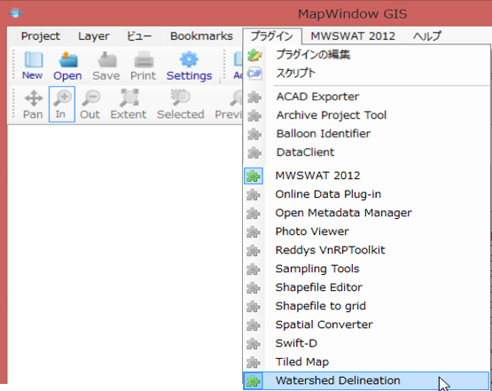  

### MWSWATプラグイン
メニューバーのMWSWAT2012を開き新しいプロジェクトファイルを作成する。  
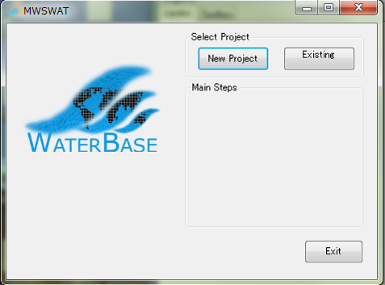  

#### delineate watersehd(流域の分割)
Step1  delineate watersehd(流域の分割)を選択する。  
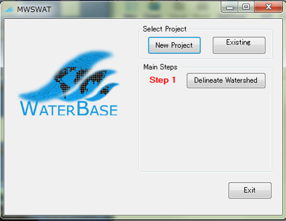  
入力するDEMを選択する  
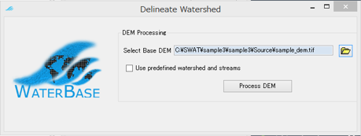  

DEMの前処理を実施する  
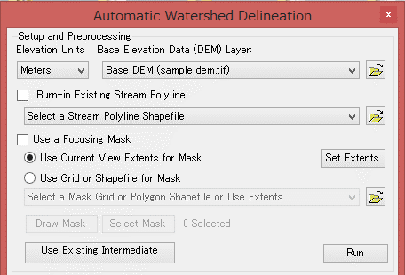  

流域面積(ここではDEMのセル数)を基準として流路を定義する  
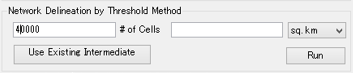  

流出点を定義する  
　手動で入力する場合は Draw Outlet/Inletを選択  
　既存のデータを利用する場合はファイルを指定する  
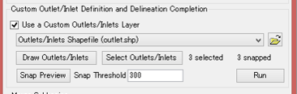  

サブ流域(subwatershed)と流路(reach)のデータセットが出力される  
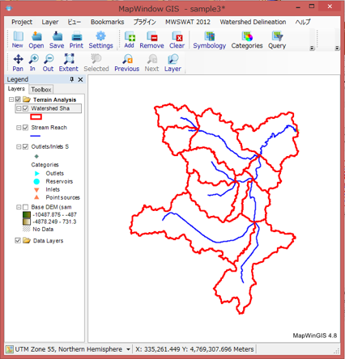  
#### Create HRUs(HRUの作成)
Step2  Create HRUsを選択する。  
  

projectファイルと同じディレクトリにある .mdbファイルを開き  xxx_landuse および xxx_soil というテーブルを作成し、土壌ラスタと土地利用データラスタのピクセル値(SOIL_ID, LANDUSE_ID)
とそれぞれの性質が記載されたDBに紐づけられた土地利用コードや土壌データの名称(SNAM, SWAT_CODE)との対応表を作成しておく。  
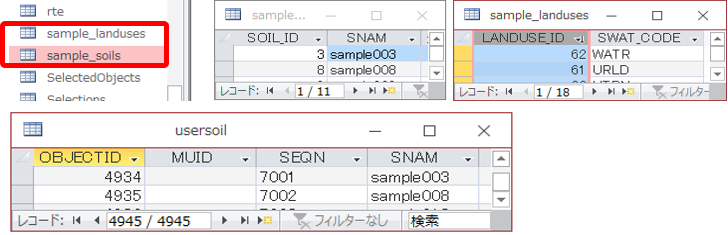  

土地利用ラスタと土壌ラスタを読み込み、landuse tabel,soil tableをそれぞれ先ほど作成した xxx_landuse, xxx_soil を選択する。必要であればgenerate FullHRUss shapefileを出力する(推奨)。地形(傾斜)によってHRUを細分する場合は Set bands for slopeで傾斜による地域のカテゴリ化を行う。  
  

細かなHRUを無視したい場合は面積そのものや面積率により閾値決定する。計算上発生するすべてのHRUを用いる場合は"0"を入力する。  
すべての設定を終えたのち Create HRUs を選択しHRUの算出を実行する。  
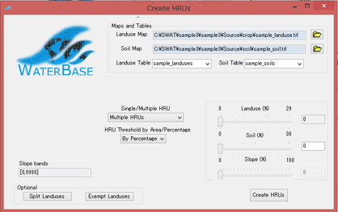  

generate FullHRUss shapefileにチェックが入っていた場合はHRUがESRI Shapefile形式で出力される  
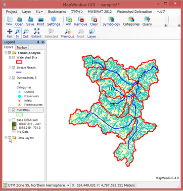  

#### SWAT Setup and Run(SWATモデルの設定と実行)
STEP3 SWAT Setup and Runを選択する。  
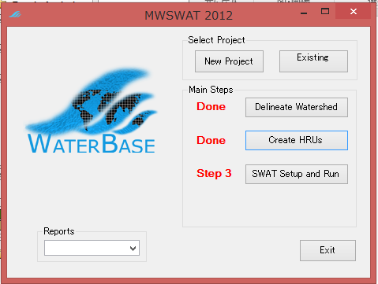  

気象データを読み込むために choose を選択する。  
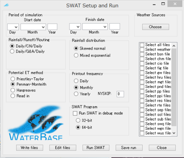  

Weather Sourceのlocalfileにチェックをいれて気象観測点のIDと位置情報をまとめた weather station file を読み込む。(weather station fileと同じディレクトリには必要とされる各種の気象データ(xxx.pcp, xxx.tmp, xxx.slr, xxx.ws, xxx.hmd,)を格納しておく)    

Weather genenator → fileにチェックを入れて、気象観測実データがない期間の気象を出力するための基礎データファイル weather generator fileを読み込む(気象データが揃っている期間についてはこの情報が必要ではないため実質使用されないことが多いが、このファイルがないと以降の処理ができないので作成しておく)  
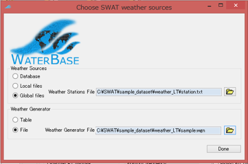  

気象データ関連データのテンプレート  
[weather dataset template](./weather/)  

wgnファイルに必要な気象データの内、若干計算が面倒な以下の要素については、次のファイル生成実行ファイルを用いることで算出が可能である。いずれもヘッダ無しのスペース区切りデータを整形したのち算出プログラムと同じディレクトリにに格納→プログラムを実行し、ファイル名や観測開始年を指定するのみでよい。(詳細は同梱されているマニュアルを参照のこと)  

xxx.pcp のデータより 降雨関連のパラメータを算出  
[SWAT Precipitation Input Preprocessors](http://swat.tamu.edu/media/83108/pcpSTAT.zip)   

PCP_MM = average monthly precipitation [mm]  
PCPSTD = standard deviation  
PCPSKW = skew coefficient  
PR_W1  = probability of a wet day following a dry day  
PR_W2  = probability of a wet day following a wet day  
PCPD   = average number of days of precipitation in month  

xxx.tmp ファイルと xxx.hmd ファイルから 気温/湿度関係のパラメータを算出  
[Dewpoint Estimation](http://swat.tamu.edu/media/83105/dewpoint.zip)

tmp_max = average daily maximum temperature in month [ｰC]  
tmp_min = average daily minimum temperature in month [ｰC]  
hmd     = average daily humidity in month [%]  
dewpt   = average daily dew point temperature in month [ｰC]  

モデルを回す期間を設定→select all fileを選択(2度目以降は変更を加えたファイルのみを選択すればよい)→write filesを選択しSWAT用パラメータファイルを生成する。  
  

ファイルの生成が成功した場合このような表示が出る。  
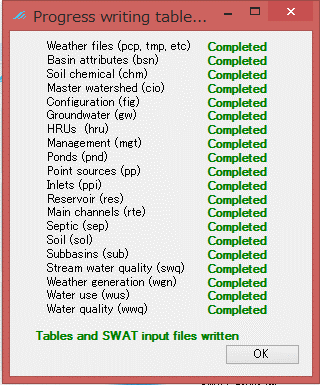  

Run SWATを選択してモデルを実行する。  
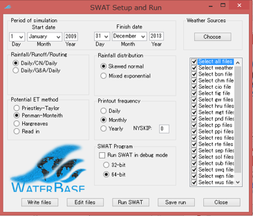  

DOSの画面に経過が表示され、正常に処理が終わればSWAT run Seccessfull のダイアログが表示される。  
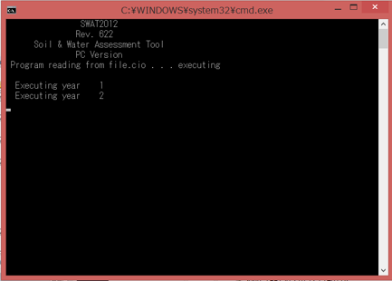  
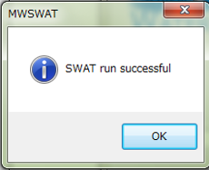  

MWSWAT plugin を用いたSWATモデル用のパラメータファイルの作成はここまで  

以降のパラメータの調整は Editfile を選択すると起動する SWATEditor 上や 生成した設定ファイルを直接編集してモデルの調整を実施する。  

